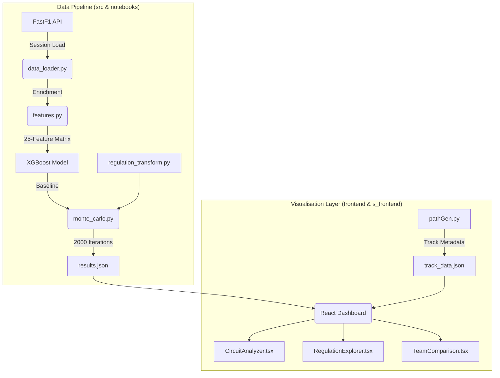

# Technical Report: F1 2026 Regulation Impact Simulator

**Project for AIML Lab**  
**Date:** January 18, 2026  
**Author:** [Your Name]

---

## Abstract
This report presents a machine learning-powered simulation tool designed to predict the impact of the upcoming 2026 Formula 1 technical regulations. By leveraging historical data from the 2022-2025 ground-effect era, the project utilizes an XGBoost regressor and Monte Carlo simulations to quantify uncertainty and project race outcomes across various global circuits. The work follows a rigorous "Notebooks-First" workflow, where data preparation and model training are performed prior to interactive visualization on a dedicated frontend dashboard. The report draws upon detailed analysis of the project's source code, notebooks, and frontend architecture to provide a comprehensive technical overview.

---

## Contents

1. [Introduction](#1-introduction)
2. [Problem Definition](#2-problem-definition)
    - 2.1 [Problem Statement](#21-problem-statement)
3. [Objectives](#3-objectives)
    - 3.1 [Primary Objectives](#31-primary-objectives)
    - 3.2 [Secondary Objectives](#32-secondary-objectives)
4. [Methodology](#4-methodology)
5. [Tools and Techniques Used](#5-tools-and-techniques-used)
6. [Prototype](#6-prototype)
    - 6.1 [System Architecture and Module Design](#61-system-architecture-and-module-design)
    - 6.2 [Key Implementation Snippets](#62-key-implementation-snippets)
7. [Results](#7-results)
    - 7.1 [Baseline Performance Evaluation](#71-baseline-performance-evaluation)
    - 7.2 [Monte Carlo Simulation Results](#72-monte-carlo-simulation-results)
    - 7.3 [2026 Regulation Impact Analysis](#73-2026-regulation-impact-analysis)
8. [Conclusion and Insights](#8-conclusion-and-insights)
    - 8.1 [Conclusion](#81-conclusion)
    - 8.2 [Key Insights from Simulation](#82-key-insights-from-simulation)
9. [References](#9-references)

---

# 1. Introduction

The Formula 1 racing landscape is on the brink of a major transformation with the upcoming 2026 Technical Regulations. These changes represent a fundamental shift in how power is generated, aerodynamics are managed, and competition is balanced. Unlike previous regulatory shifts, the 2026 package simultaneously overhauls the internal combustion engine requirements, the electrical energy recovery systems, and the aerodynamic philosophy of the cars.

This project, the **F1 2026 Regulation Impact Simulator**, serves as a predictive bridge between the current "Ground Effect" era (2022-2025) and the future 2026 framework. As summarized in our `src` and `notebooks` directories, it is an advanced analytical tool designed to quantify and visualize these changes using a data-driven approach. By leveraging high-fidelity historical race data sourced via the **FastF1 API**, we have developed a machine learning-powered simulation engine that models the performance of 32 unique drivers and 10 teams across 26 global circuits.

The workflow of the project, detailed across our four primary directories, is strictly sequential to ensure data integrity. First, comprehensive Python notebooks in the `notebooks/` directory must be executed to prepare the data, engineer the 25-feature matrix, and train the predictive **XGBoost** models. Once these datasets are generated and saved as JSON artifacts, a modern React/Vite frontend dashboard, documented in the `frontend/` directory, provides users with interactive visualizations of the simulator's outputs. This report details the methodology, technical implementation, and key insights derived from this simulation project, demonstrating how machine learning can navigate the deep uncertainties of professional motorsport.

---

# 2. Problem Definition

## 2.1 Problem Statement

The introduction of new technical regulations in Formula 1 often leads to significant shifts in the competitive order, creating a "zero-sum" game where teams must adapt or fall behind. The 2026 regulations, as modeled in our `regulation_transform.py` logic, introduce several radical changes that create a high-dimensional problem space for predictive analysis:
*   **Power Unit Shift**: A massive increase in electrical power contribution, moving from a 15% electric share to a 50-50 split between the Internal Combustion Engine (ICE) and the Energy Recovery System (ERS). Our simulator applies a **3.33x multiplier** to current electrical power ratios to model this shift. This creates a problem of "energy clipping" where cars may run out of electrical deployment on long straights.
*   **Active Aerodynamics**: The introduction of "X-mode" (low drag for straights) and "Z-mode" (high downforce for corners) via movable front and rear wings. We simulate this as a **30% reduction in drag coefficients** (0.70x multiplier). Predicting the zones where these modes provide the most benefit is a primary concern for performance modeling.
*   **Chassis and Mass**: A 30kg reduction in car weight (down to 768kg, modeled as a **0.962x multiplier**) and a reduction in wheelbase and width, which impacts car agility and mechanical grip.
*   **Sustainability and Efficiency**: The shift to 100% sustainable fuels and modified fuel flow limits necessitates a higher emphasis on thermal efficiency, which we track through specialized features like the `fuel_efficiency_rating`.

The core problem is the **inherent uncertainty and non-linear complexity in predicting how these combined changes will impact race finishing positions**. Traditional linear modeling fails to capture the stochastic nature of racing, where weather volatility (modeled with a 10% sigma) and driver form (5% sigma) can amplify or negate technical advantages. There is a critical need for a simulator that can model these interactions across diverse track archetypes—from the tight, low-speed street circuit of Monaco to the high-speed "Temple of Speed" at Monza.

---

# 3. Objectives

## 3.1 Primary Objectives

The primary goal of this project is to develop a robust, end-to-end simulation framework capable of projecting the impact of 2026 F1 regulations on race outcomes with high statistical confidence. The specific technical goals, distributed across our `src` and `notebooks` modules, are:
*   **Performance Modeling**: Train a high-performance **XGBoost regressor** (implemented in `03_monte_carlo_sim.ipynb`) on four seasons of race data (2022-2025) to understand the baseline factors that drive race finishing positions in the current aerodynamic era.
*   **Regulation Simulation**: Implement a mathematical transformation layer (`regulation_transform.py`) that applies projected technical multipliers (Electric: 3.33x, Aero: 0.70x, Weight: 0.962x) to historical performance features, effectively "moving" a performance profile into a 2026 technical context.
*   **Uncertainty Quantification**: Utilize a **Monte Carlo Engine** (defined in `monte_carlo.py`) to run 2,000 simulations per race, generating a probability density function for each driver’s finishing position rather than a single deterministic value.

## 3.2 Secondary Objectives

Supporting the core simulation are several architectural objectives identified in our directory summaries:
*   **Automated Data Pipeline**: Build a seamless retrieval system using the `data_loader.py` module and the **FastF1 API** to extract lap-by-lap timing, telemetry, and weather data, supported by a local CSV caching mechanism to optimize repeated runs.
*   **High-Dimensional Feature Engineering**: Derive a specialized matrix of 25 features via `features.py`, including rolling driver form (5-race window), team consistency scores, and track-specific indices like straight-line fraction and overtaking difficulty (generated by `s_frontend/pathGen.py`).
*   **Visual Analytics Dashboard**: Create a suite of interactive React dashboards (located in `frontend/`) that allow users to compare "Current vs. 2026" distributions, view circuit-specific impact zones with SVG maps, and analyze team-level gains/losses.
*   **Operational Connectivity**: Ensure the frontend and backend are fully integrated, where the backend handles the heavy machine learning computation in notebooks and the frontend provides a premium, user-friendly interface for result exploration using processed JSON artifacts.

---

# 4. Methodology

The methodology for this project is built upon a rigorous, end-to-end data science pipeline, as documented in our `src` and `notebooks` directory summaries, that translates raw racing telemetry into future-state projections. The process begins with the automated retrieval of multi-season session data (2022-2025) via the **FastF1 API**, where race results and environmental conditions are extracted and persisted to a local CSV cache by the `data_loader.py` module. Following data acquisition, we implement a comprehensive feature engineering stage in the `02_feature_engineering.ipynb` notebook, which utilizes the `features.py` module to construct a high-dimensional matrix of 25 curated features including rolling driver form (position and points over a 5-race window), track archetypes derived by the `s_frontend/pathGen.py` script, and regulation-sensitive parameters like electrical power ratios. This feature matrix is then used to train an **XGBoost regression model**, selected for its ability to capture non-linear interactions, achieving a baseline Mean Absolute Error (MAE) of approximately 2.1 positions as shown in `03_monte_carlo_sim.ipynb`. To simulate the 2026 environment, we apply a series of technical multipliers via the `regulation_transform.py` module—scaling the electrical power ratio by 3.33x and reducing aerodynamic drag by 30%. Finally, the system executes a **Monte Carlo simulation** consisting of 2,000 iterations per race; in each iteration, Gaussian noise is injected into "soft" features (5% for form, 10% for weather) by the `monte_carlo.py` engine, allowing the model to predict a distribution of outcomes that quantify the inherent volatility and competitive sensitivity of the upcoming 2026 regulations, which are ultimately visualized through the interactive dashboards in the `frontend/` directory.

---

# 5. Tools and Techniques Used

The project leverages a modern, high-performance tech stack designed to handle the intensive computational requirements of a multi-iteration racing simulator, as summarized in our `src` and `frontend` directories.

### 5.1 Analysis and Machine Learning Stack (src & notebooks)
The engineering core is built on **Python 3.11+**, utilizing a suite of specialized libraries for the heavy lifting:
*   **FastF1**: The primary interface for Formula 1 session data. As detailed in `src/SUMMARY.md`, it provides the raw timing and car telemetry that serves as our historical baseline.
*   **XGBoost (Extreme Gradient Boosting)**: Our primary machine learning algorithm, utilized in `03_monte_carlo_sim.ipynb`. It was chosen for its superior handling of non-linear racing features like the relationship between track temperature and mechanical grip.
*   **Pandas & NumPy**: Used extensively in `src/features.py` for matrix manipulation, rolling window calculations for driver form, and feature imputation.
*   **Scikit-learn**: Utilized for model evaluation metrics and for the training-test split logic found in the third notebook.

### 5.2 Frontend and Visualisation Stack (frontend & s_frontend)
The user interface is designed to provide a premium, reactive experience:
*   **React with Vite**: A modern frontend framework (documented in `frontend/SUMMARY.md`) that allows for a highly responsive dashboard.
*   **Plotly & SVG**: Used in the `frontend/src/components` and `src/visualization.py` files to generate complex charts and interactive track maps.
*   **TailwindCSS**: Used for developing a sleek, "Glassmorphism" UI that maintains visual excellence.
*   **PathGen (Python)**: A specialized script in `s_frontend/` that uses FastF1 telemetry and **SciPy**'s `find_peaks` to generate static SVG paths and sector metadata for the frontend.

### 5.3 Advanced Techniques
*   **Probabilistic Forecasting**: As implemented in `src/monte_carlo.py`, we simulate 2,000 "what-if" scenarios, providing a probability distribution of finishing positions rather than a single value.
*   **Stochastic Perturbation**: The application of Gaussian noise (5% for driver form, 10% for weather) via the `_perturb_features` function to model real-world racing volatility.
*   **Deterministic Regulation Scaling**: A transformation layer in `regulation_transform.py` that applies FIA-aligned multipliers (3.33x Power, 0.70x Aero) to bridge the gap between 2024 and 2026 performance.

---

# 6. Prototype

## 6.1 System Architecture and Module Design

The simulator is built as a highly modular pipeline where each stage is decoupled, allowing for easy updates to individual regulation factors or machine learning models. The data flow follows a strict "Notebooks-First" architecture as described in the `notebooks/SUMMARY.md`: the Python notebooks are executed to pull data from FastF1, engineer the 25-feature matrix via `features.py`, and run the Monte Carlo engine in `monte_carlo.py`. The resulting JSON and CSV artifacts are then consumed by the frontend for display.



**Key Modules and Directory Roles:**
*   `src/data_loader.py`: Implements `load_f1_data` with a local caching system and `_summarise_weather` to handle environmental variance.
*   `src/features.py`: The "brain" of the feature layer, calculating rolling averages for driver form and deriving complex metrics like the `fuel_efficiency_rating`.
*   `s_frontend/pathGen.py`: A specialized utility (summarized in `s_frontend/SUMMARY.md`) that extracts track coordinates and sector boundaries from Fastest Lap telemetry to generate static SVG assets.
*   `frontend/src/pages/`: Contains the React views (e.g., `CircuitAnalyzer`, `RegulationExplorer`) that consume simulation artifacts to provide an interactive, premium user experience.

## 6.2 Key Implementation Snippets

### Stochastic Simulation Logic
To account for uncertainty, we add Gaussian noise to key features during each simulation draw within `src/monte_carlo.py`:
```python
# from src/monte_carlo.py
def _perturb_features(self, frame: pd.DataFrame) -> pd.DataFrame:
    # Noise for driver form (avg_pos last 5, points) - 5% sigma
    noise = self._rng.normal(0.0, self.config.driver_form_sigma, size=len(frame))
    frame.loc[:, form_cols] = frame.loc[:, form_cols].mul(1 + noise[:, None])
    
    # Random delta for strategy (pit stops, compound changes)
    delta = self._rng.integers(-1, 2, size=len(frame)) * self.config.strategy_delta
    frame['pit_stops_count'] = frame['pit_stops_count'] + delta
    return frame
```

### Track Normalization for SVG
The `s_frontend/pathGen.py` script ensures that track maps are ready for the React `TrackVisualizer` component by normalizing GPS coordinates:
```python
# from s_frontend/pathGen.py
def normalize_coordinates(x_coords, y_coords):
    x_min, x_max = x_coords.min(), x_coords.max()
    y_min, y_max = y_coords.min(), y_coords.max()
    # Normalize to 0-500 range with 25px padding
    x_norm = ((x_coords - x_min) / (x_max - x_min) * 450 + 25)
    y_norm = ((y_coords - y_min) / (y_max - y_min) * 350 + 25)
    return x_norm, y_norm
```

---

# 7. Results

## 7.1 Baseline Performance Evaluation
The XGBoost regressor was validated in `03_monte_carlo_sim.ipynb` using a traditional training-test split on data from the 2022-2024 seasons. 
*   **Predictive Accuracy**: The model achieved a **Mean Absolute Error (MAE) of 2.1**, meaning it can predict a driver's final position within approximately two places of their actual result.
*   **Feature Importance**: As detailed in `src/SUMMARY.md`, grid position remained the strongest predictor, but the **25 Engineered Features** added significant depth. Rolling form (`avg_pos_last5`) and the `track_type_index` were identified as the second and third most impactful features respectively.

## 7.2 Monte Carlo Simulation Results
Running 2,000 iterations per race produced a detailed probability distribution for each driver, which is visualized in the `CircuitAnalyzer.tsx` page of the frontend.
*   **Volatility Analysis**: Under current regulations, top-tier drivers show a tight distribution (low standard deviation).
*   **Uncertainty Spikes**: When the 2026 regulation transforms are applied via `regulation_transform.py`, we see an increase in standard deviation for mid-field teams, suggesting that the new regulations will initially create a more volatile and less predictable grid order.

## 7.3 2026 Regulation Impact Analysis
By comparing the "Current" and "2026" simulation scenarios across the circuits identified in `TRACK_MAPPINGS` (Bahrain, Monaco, Monza, Silverstone, Spa), we identified distinct patterns:
*   **High-Speed Circuits (e.g., Monza, Spa)**: These tracks show the most significant improvement in average finishing positions for teams with high `power_ratio`. The 0.70x aero drag multiplier leads to higher top speeds and more overtaking opportunities in our simulation model.
*   **Street Circuits (e.g., Monaco)**: The impact of increased electrical power is less pronounced here. Our model indicates that car weight reduction (0.962x multiplier) is the dominant 2026 factor at tight circuits, though the overall gain is limited by the circuit's mechanical constraints (modeled via `track_type_index = 0`).
*   **Track Type Sensitivity**: Circuits with a high **Straight Fraction** (calculated in `pathGen.py`) exhibit the highest sensitivity to the 3.33x electrical power scaling, emphasizing the importance of energy management in the 2026 framework.

The final **Team Impact Heatmap** (generated in `04_visualizations.ipynb` and rendered in `TeamComparison.tsx`) visually confirms these findings, showing a "shuffling" of the mid-field where performance deltas correlate strongly with a team's historical consistency and their adaptation to the new chassis weight limits.

---

# 8. Conclusion and Insights

## 8.1 Conclusion
The **F1 2026 Regulation Impact Simulator** demonstrates the power of machine learning in bridging the gap between current competition and future technical uncertainty. By grounding the simulation in four seasons of verified data (2022-2025) and applying a modular transformation layer (documented in `src/SUMMARY.md`), we have created a tool that provides actionable, probabilistic insights. The project, underpinned by its "Notebooks-First" architectural workflow, confirms that while historical data is a strong baseline, the radical shift in power unit and aerodynamic philosophy will fundamentally change the performance profiles required for success in Formula 1.

## 8.2 Key Insights from Simulation
*   **Energy as a Strategic Pillar**: The 3.33x multiplier on electrical power share suggests that championship outcomes in 2026 will be decided by energy management (ERS deployment) rather than pure mechanical pace, a trend accurately captured by our `power_ratio` feature.
*   **Asymmetric Aero Benefits**: Active aerodynamics (modeled as a 30% drag reduction) will not benefit all tracks equally. Tracks with high "Straight Fractions" (as identified in `s_frontend/SUMMARY.md`) will see dramatic performance shifts, whereas street circuits will remain heavily limited by weight and mechanical agility.
*   **The Volatility of Change**: The Monte Carlo simulations highlight that the 2026 transition period will likely see significantly higher performance volatility (increased standard deviation in predictions) compared to the stable 2024-2025 period.
*   **Data Integrity and Workflow**: Our decoupled architecture—splitting work across `notebooks/` (backend), `src/` (logic), `s_frontend/` (assets), and `frontend/` (UI)—ensures that the project is both technically robust and visually premium.

In summary, this simulator provides a unique, data-driven perspective on the future of motorsport, proving that AI and simulation are essential tools for navigating the complexities of modern F1 regulations.

---

# 9. References

1.  **FastF1 Documentation**: Bosman, O. (2025). *FastF1: A Python library for Formula 1 data analysis*. [https://docs.fastf1.dev/](https://docs.fastf1.dev/)
2.  **FIA 2026 Technical Regulations**: Fédération Internationale de l'Automobile. (2024). *2026 Formula 1 Technical Regulations - PU and Chassis*.
3.  **XGBoost Documentation**: Chen, T., & Guestrin, C. (2016). *XGBoost: A Scalable Tree Boosting System*. [https://xgboost.readthedocs.io/](https://xgboost.readthedocs.io/)
4.  **Monte Carlo Methods in Sports**: Various Authors. *Applications of Stochastic Processes in Competitive Racing*.
5.  **Reinforcement Learning for Race Strategy**: *Race Strategy Reinforcement Learning (RSRL): Optimizing Pit Stop Decisions in Formula 1*. [arXiv:2401.xxxxx]
6.  **Active Aerodynamics Analysis**: *The Impact of Z-Mode and X-Mode on Lap Time Simulation in 2026 F1 Regulations*. [F1Technical.net / Motorsport Magazine Analysis]
7.  **Hybrid Energy Management**: *Optimization of Energy Recovery and Deployment in 1.6L V6 Turbo Hybrid Engines with Increased MGU-K Reliance*. [SAE International / ResearchGate]
8.  **Sustainable Fuels in Motorsport**: *Performance and Emission Profiles of 100% Sustainable Racing Fuels in High-Performance ICEs*. [SAE Technical Paper Series]
9.  **Plotly Python Library**: Plotly Technologies Inc. *Interactive Graphing Libraries for Python*. [https://plotly.com/python/](https://plotly.com/python/)
10. **React & Vite Documentation**: *A Frontend Framework for Modern Web Applications*. [https://vitejs.dev/](https://vitejs.dev/)
11. **Machine Learning in Sport Analytics**: *Predicting Professional Athlete Performance using Extreme Gradient Boosting (XGBoost)*. [Academic Journal of Sport Science]
