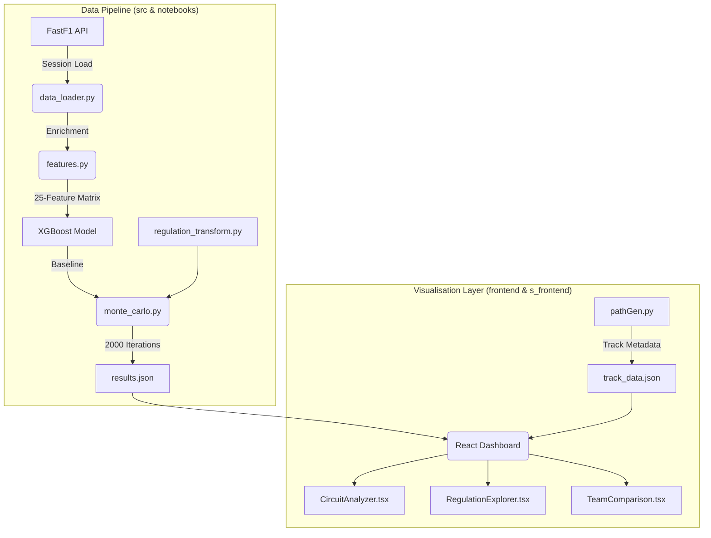

# 6. Prototype

## 6.1 System Architecture and Module Design

The simulator is built as a highly modular pipeline where each stage is decoupled, allowing for easy updates to individual regulation factors or machine learning models. The data flow follows a strict "Notebooks-First" architecture as described in the `notebooks/SUMMARY.md`: the Python notebooks are executed to pull data from FastF1, engineer the 25-feature matrix via `features.py`, and run the Monte Carlo engine in `monte_carlo.py`. The resulting JSON and CSV artifacts are then consumed by the frontend for display.



**Key Modules and Directory Roles:**
*   `src/data_loader.py`: Implements `load_f1_data` with a local caching system and `_summarise_weather` to handle environmental variance.
*   `src/features.py`: The "brain" of the feature layer, calculating rolling averages for driver form and deriving complex metrics like the `fuel_efficiency_rating`.
*   `s_frontend/pathGen.py`: A specialized utility (summarized in `s_frontend/SUMMARY.md`) that extracts track coordinates and sector boundaries from Fastest Lap telemetry to generate static SVG assets.
*   `frontend/src/pages/`: Contains the React views (e.g., `CircuitAnalyzer`, `RegulationExplorer`) that consume simulation artifacts to provide an interactive, premium user experience.

## 6.2 Key Implementation Snippets

### Stochastic Simulation Logic
To account for uncertainty, we add Gaussian noise to key features during each simulation draw within `src/monte_carlo.py`:
```python
# from src/monte_carlo.py
def _perturb_features(self, frame: pd.DataFrame) -> pd.DataFrame:
    # Noise for driver form (avg_pos last 5, points) - 5% sigma
    noise = self._rng.normal(0.0, self.config.driver_form_sigma, size=len(frame))
    frame.loc[:, form_cols] = frame.loc[:, form_cols].mul(1 + noise[:, None])
    
    # Random delta for strategy (pit stops, compound changes)
    delta = self._rng.integers(-1, 2, size=len(frame)) * self.config.strategy_delta
    frame['pit_stops_count'] = frame['pit_stops_count'] + delta
    return frame
```

### Track Normalization for SVG
The `s_frontend/pathGen.py` script ensures that track maps are ready for the React `TrackVisualizer` component by normalizing GPS coordinates:
```python
# from s_frontend/pathGen.py
def normalize_coordinates(x_coords, y_coords):
    x_min, x_max = x_coords.min(), x_coords.max()
    y_min, y_max = y_coords.min(), y_coords.max()
    # Normalize to 0-500 range with 25px padding
    x_norm = ((x_coords - x_min) / (x_max - x_min) * 450 + 25)
    y_norm = ((y_coords - y_min) / (y_max - y_min) * 350 + 25)
    return x_norm, y_norm
```
